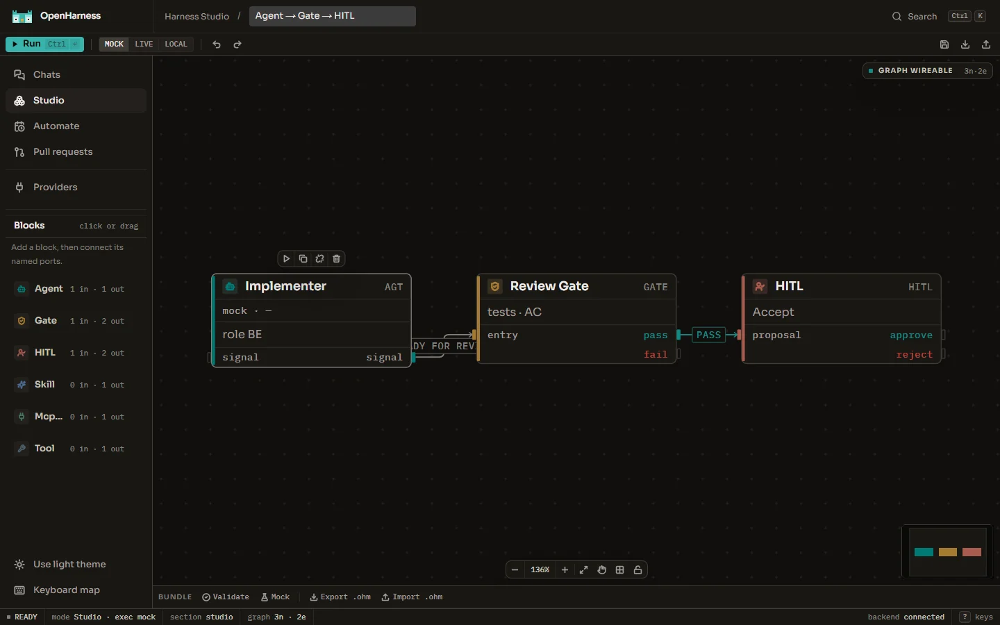
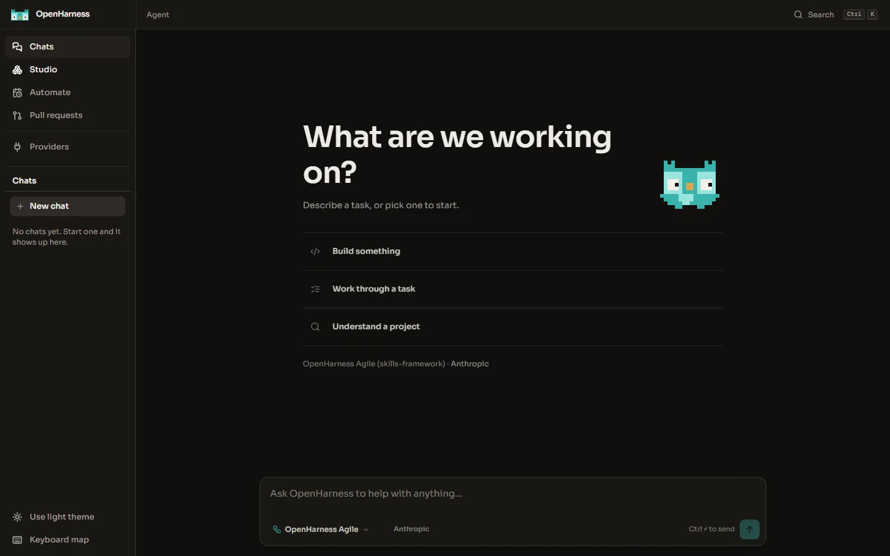
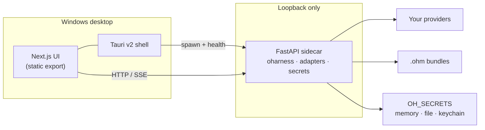
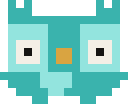

<p align="center">
  
</p>

<h1 align="center">OpenHarness</h1>

<p align="center">
  <strong>Agent + Harness Design Studio</strong> for your desktop.<br />
  Design the crew. Wire the gates. Run against <em>your</em> providers.
</p>

<p align="center">
  <a href="https://klebertiko.github.io/OpenHarness/">Product site (pt-BR)</a>
  ·
  <a href="https://klebertiko.github.io/OpenHarness/en/">English</a>
  ·
  <a href="docs/harness-spec/README.md">OHM format</a>
  ·
  <a href="docs/ci-security.md">CI &amp; security</a>
  ·
  <a href="SECURITY.md">Vulnerability reporting</a>
</p>

<p align="center">
  
  
  
  
  
</p>

---

## What this is

OpenHarness is a **desktop application** (Tauri v2 + FastAPI sidecar) where you author and run **agent harnesses** — composed systems of Agents, Gates, HITL checkpoints, Skills, and Signals — against the LLM providers you already pay for (Anthropic, OpenAI, OpenRouter, Ollama, Cursor, …).

The portable format is the **Open Harness Model (OHM)**: a `.ohm` bundle (YAML 1.2 authoring profile; legacy JSON still readable). OpenHarness ships with one **example** Agile harness (`openharness.default.agile`) so you can open the app and see a full crew immediately. Every user authors and shares their own harnesses — the example is a starting point, not the product.

Nilo is the front door — a small presence who greets you, answers what she can, and hands real work to the loaded harness or to a provider-native path. She is not a role in the crew.

---

## Product surfaces

<p align="center">
  
</p>

<p align="center"><em>Studio</em> — author the graph, validate the bundle, inspect gates.</p>

<p align="center">
  
</p>

<p align="center"><em>Chats</em> — talk to Nilo; escalate into the harness when the work needs a crew.</p>

| Surface | Intent |
| --- | --- |
| **Studio** | Visual harness authoring, validation, mock/live modes |
| **Agent / Chats** | Direct runs and harness-bound conversations; chat tools (`/exec`, `/read`, `/ls`) with HITL approval for exec |
| **Providers** | Wallet of connections — cloud, local, CLI adapters |
| **Cowork** | Authorized workspace context for tool use |
| **Automations** | Scheduled / on-demand simulations against a harness |
| **Git** | Repo-aware review surfaces (evolving) |

---

## Architecture



- **Shell** owns the window, WebView, and sidecar lifecycle (port on `127.0.0.1`, process tied to the app).
- **Sidecar** owns execution, OHM validate/run, provider adapters, and credential storage.
- **Credentials never leave your machine** through OpenHarness cloud — there is none for inference.

Packaging decision: [`docs/adr/0001-desktop-packaging.md`](docs/adr/0001-desktop-packaging.md).

---

## Quick start

### Prerequisites

| Tool | Notes |
| --- | --- |
| **Rust** (`rustup`) + MSVC Build Tools | Tauri / WebView2 linkage |
| **WebView2** | Usually present on Windows 10/11 |
| **Node.js 22** | See [`.nvmrc`](.nvmrc) |
| **Python 3.12+** | Sidecar |

### Development loop (no installer)

```bash
# Terminal A — sidecar
cd backend
python -m pip install -r requirements.txt
python -m uvicorn main:app --host 127.0.0.1 --port 8000

# Terminal B — UI
cd frontend
npm ci
npm run dev
```

Full desktop loop (builds sidecar, opens Tauri):

```bash
npm ci
npm run tauri:dev
```

### Windows installer (local delivery gate)

```bash
npm ci
npm run desktop:release
```

Artifact:

```text
src-tauri/target/release/bundle/nsis/OpenHarness_*_x64-setup.exe
```

`desktop:release` builds, smoke-tests, installs the current-user copy, and validates again. It fails if the UI does not render, the sidecar is unhealthy or exposed outside loopback, the window cannot close cleanly, or a sidecar process remains after quit.

Manual smoke after install:

```powershell
npm run desktop:smoke
# or
powershell -File scripts/smoke-desktop.ps1 -AppPath <path-to-exe>
```

### Secrets backend

| `OH_SECRETS` | Store |
| --- | --- |
| `memory` | Process lifetime (tests / explicit dev) |
| `file` | Default when packaged — Fernet files under `%LOCALAPPDATA%/OpenHarness/secrets` |
| `keychain` | OS keychain (`pip install keyring`) |

---

## Open Harness Model (`.ohm`)

Portable harness bundles: graph, roles, gates, embedded skills/agents/hooks.

| Doc | Purpose |
| --- | --- |
| [`docs/harness-spec/HELLO.md`](docs/harness-spec/HELLO.md) | Minimal valid shape |
| [`docs/harness-spec/README.md`](docs/harness-spec/README.md) | Public entry + schema links |
| [`backend/oharness/fixtures/default-agile.ohm`](backend/oharness/fixtures/default-agile.ohm) | Product default |
| [`docs/adr/0003-ohm-yaml.md`](docs/adr/0003-ohm-yaml.md) | YAML 1.2 authoring profile |

```bash
cd backend
python -m oharness validate oharness/fixtures/default-agile.ohm
```

Default harness id: `openharness.default.agile`.

---

## Repository layout

```text
OpenHarness/
├── frontend/          Next.js App Router UI (static export for Tauri)
├── backend/           FastAPI sidecar · oharness codec · adapters · sandbox
├── src-tauri/         Tauri v2 shell · NSIS bundle · embedded default .ohm
├── website/           Product site (pt-BR + en) — no backend coupling
├── docs/              ADRs, harness-spec, CI/security policy
├── scripts/           Sidecar build, desktop smoke, advisory Laya shadow
└── .github/           CI, security, SBOM, Scorecard, release, Laya shadow
```

---

## CI, security, and releases

Quality and security are **independent** required checks. Probabilistic classifiers (including optional Laya shadow triage) are **advisory evidence only** — they never decide merge or ship.

| Check | Role |
| --- | --- |
| `CI / Required` | Frontend, backend, Rust/Tauri, website, Compose |
| `Security / Required` | Dependency review, CodeQL, OpenGrep, Trivy, Gitleaks, zizmor |
| Scheduled | CycloneDX SBOMs, OWASP Dependency-Check, OpenSSF Scorecard, npm/pip/cargo audits |
| Tag `vX.Y.Z` | Version gate → Windows NSIS → smoke → checksums → SBOM + attestations |

Package installs in CI go through **Aikido Safe Chain** (checksum-pinned installer). External Actions are pinned to full commit SHAs.

Full policy and admin checklist: [`docs/ci-security.md`](docs/ci-security.md).

Release verification (after a published tag):

```bash
gh attestation verify OpenHarness_*_x64-setup.exe --repo klebertiko/OpenHarness
```

GitHub attestations prove provenance; they do not replace Authenticode. EV / Azure Artifact Signing remains a hard requirement before treating builds as production distribution.

---

## Website

Static product pages — no agent execution, no telemetry, loopback-only local server:

```bash
cd website
npm ci
npm run dev          # http://127.0.0.1:4174
```

Published: [klebertiko.github.io/OpenHarness](https://klebertiko.github.io/OpenHarness/) (pt-BR) · [/en/](https://klebertiko.github.io/OpenHarness/en/).

---

## Domain vocabulary (short)

Use these names in issues, PRs, and docs — see [`CONTEXT.md`](CONTEXT.md) when present:

| Term | Meaning |
| --- | --- |
| **OHM** | Portable harness document (`.ohm`) |
| **Harness** | Agents + Gates + HITL + Skills + Signals |
| **Gate** | Blocking checklist with PASS/FAIL routing |
| **HITL** | Human authority (merge, acceptance) — not an Agent |
| **Signal** | Typed exit state on an edge |
| **Provider** | Registered LLM backend with credentials |

---

## Contributing

1. Prefer small PRs against `main` with required checks green.
2. Do not weaken CI/Security gates to force a green run — fix the finding.
3. Desktop changes should pass `npm run desktop:smoke` (or `desktop:release` for packaging).
4. OHM changes: validate with `python -m oharness validate` and keep fixtures in sync.

Security reports: [`SECURITY.md`](SECURITY.md) — use GitHub private vulnerability reporting, not public issues.

---

## License

Public preview. Licensing for redistribution will be stated explicitly before a production release; until then treat the tree as source-available for evaluation and contribution under maintainer guidance.

---

<p align="center">
  <br />
  <sub>Quiet, warm, precise — Nilo greets; the crew ships.</sub>
</p>
