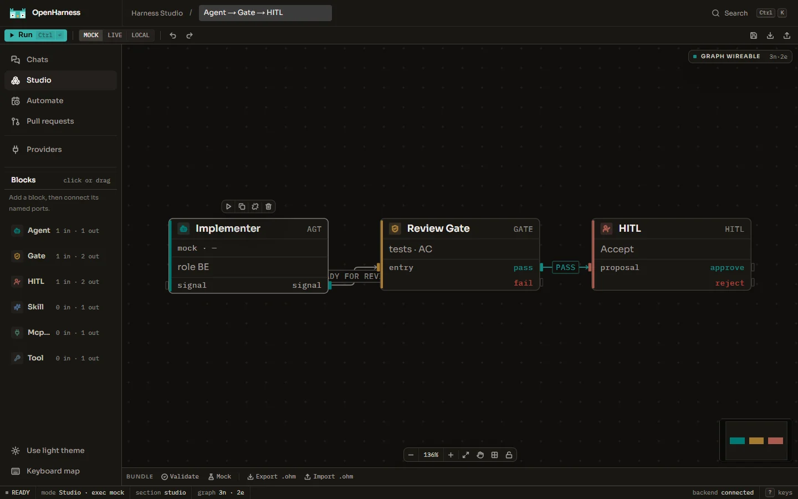
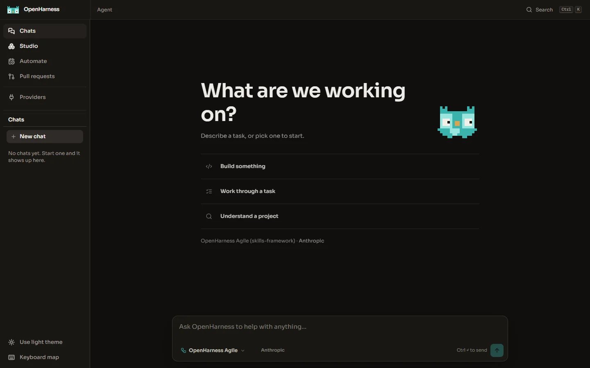
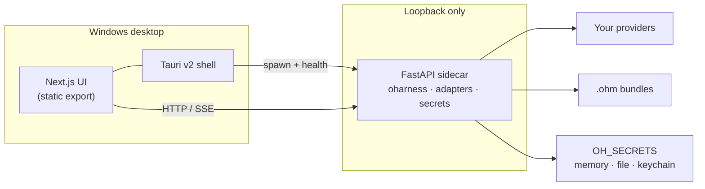
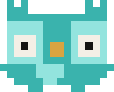

<p align="center">
  
</p>

<h1 align="center">OpenHarness</h1>

<p align="center">
  <strong>Agent + Harness Design Studio</strong> for your desktop.<br />
  Design the crew. Wire the gates. Run against <em>your</em> providers.
</p>

<p align="center">
  <a href="https://klebertiko.github.io/OpenHarness/">Product site (pt-BR)</a>
  ·
  <a href="https://klebertiko.github.io/OpenHarness/en/">English</a>
  ·
  <a href="docs/harness-spec/README.md">OHM format</a>
  ·
  <a href="docs/ci-security.md">CI &amp; security</a>
  ·
  <a href="SECURITY.md">Vulnerability reporting</a>
</p>

<p align="center">
  
  
  
  
  
</p>

---

## What this is

OpenHarness is a **desktop application** (Tauri v2 + FastAPI sidecar) where you author and run **agent harnesses** — composed systems of Agents, Gates, HITL checkpoints, Skills, and Signals — against the providers you connect: Anthropic and OpenAI through their local CLIs, OpenRouter with an API key, Ollama (local or cloud), and Cursor for delegated agent tasks. See [Providers](#providers).

The portable format is the **Open Harness Model (OHM)**: a `.ohm` bundle, authored in YAML 1.2 ([ADR 0003](docs/adr/0003-ohm-yaml.md)). Three harnesses ship bundled so you can open the app and see a full crew immediately:

| Harness | Id | Source |
| --- | --- | --- |
| **Agile Harness** (the default) | `openharness.default.agile` | Compiled from the `engineering/harness` skill in `skills-framework` |
| **DeepSeek Harness** | `openharness.example.deepseek-harness` | [deepseek-ai/deepseek-harness](https://github.com/deepseek-ai/deepseek-harness), desktop release `dsh-v0.2.1-alpha.2` |
| **Matt Pocock skills** | `openharness.example.mattpocock-skills` | [mattpocock/skills](https://github.com/mattpocock/skills) |

The last two model published projects and cite their sources in their descriptions; they set no provider and ship no secrets. Every user authors and shares their own harnesses — the bundled ones are starting points, not the product.

Nilo is the front door — a small presence who greets you and answers what she can. When a request needs the crew, she starts the loaded harness. She is not a role in the crew.

---

## Product surfaces

<p align="center">
  
</p>

<p align="center"><em>Studio</em> — author the graph, validate the bundle, inspect gates.</p>

<p align="center">
  
</p>

<p align="center"><em>Chats</em> — talk to Nilo; escalate into the harness when the work needs a crew.</p>

The app has three destinations, reachable with `Alt+1` to `Alt+3`.

| Surface | Intent |
| --- | --- |
| **Chats** (`Alt+1`) | Direct runs and harness-bound conversations. Chat tools (`/exec`, `/read`, `/ls`) run through the sidecar; `/exec` waits for your approval. Composer chips pick the provider for the chat and the workspace folder it works in (no folder runs in a scratch directory). |
| **Studio** (`Alt+2`) | Visual harness authoring, validation, mock/live modes. Describe a flow to Nilo or open a bundled harness. |
| **Providers** (`Alt+3`) | The roster of connections — cloud, local, CLI. See [Providers](#providers). |

**Removed:** Automate and Pull requests no longer exist. The `/automations` and `/repos` routes are gone (breaking change, #31).

### Studio files

Starting points on the Studio overview are "Agent + review" and the bundled harnesses above. The editor bar shows the harness name, where it came from (Example, Draft or Saved harness) and whether it has unsaved changes.

| Action | What it does |
| --- | --- |
| New, Open example, Import, Export | Start a blank harness, open a bundled harness as an editable copy (the bundled one is never changed), import or export a `.ohm`. In the desktop app, Export opens the native Save dialog. |
| Save / Save as… | Save writes a harness you already own. On an unedited example it creates an editable copy. Save as always creates a new harness and opens the copy. |
| Discard / Delete | Discard drops a draft, or returns a saved harness to its last saved version. Delete removes a draft or a saved harness. Both ask for confirmation. |
| Use in chat | Makes the open harness the one the chat runs. |

### Nilo in Studio

In Studio, **Ask Nilo** (or `Mod+I`) opens a side panel where you describe a flow in plain language and Nilo, the OpenHarness assistant, proposes graph edits: nodes added, wired and configured. The proposal appears as a list of changes you **Keep** or **Undo**; applying it is one undoable step, and every change is validated against the graph rules before it reaches the canvas. With a connected provider the request goes to that model (one repair attempt on an invalid reply). With none, a deterministic offline planner answers instead, and the result is tagged *Offline draft*. In the Inspector, **Assist** drafts, improves or reviews the free-text fields of agents, skills and gates, also offline when no provider is ready. Secrets, endpoints, commands and provider ids are never sent. The transcript is session-only and replies are not streamed.

---

## Providers

Five vendors. Anthropic and OpenAI connect through the CLI you are already signed in to, so OpenHarness stores no key for them.

| Vendor | Connects through | Notes |
| --- | --- | --- |
| **Anthropic** | Local `claude` CLI (`claude login`) | Runs on your Claude subscription. Tool execution is disabled; it answers chat only. |
| **OpenAI** | Local `codex` CLI (`codex login`) | Runs on your ChatGPT subscription. Shell commands go through a read-only sandbox. |
| **OpenRouter** | API key (`sk-or-…`) | You pick a route, an ordered model preference, not a single model. |
| **Ollama** | Local daemon, default `http://127.0.0.1:11434/v1`, no key | Ollama Cloud is a separate connection. |
| **Cursor** | Local `cursor-agent` CLI (`cursor-agent login`) | Agent-only: an LLM node cannot use it, a Delegate node can. On Windows it runs inside WSL2 (distro `Ubuntu-24.04` by default, override with `OPENHARNESS_CURSOR_WSL_DISTRO`); the native Windows `cursor-agent` stays blocked. |

- **Chat picker.** Lists "Auto" (the first eligible connection, cloud before on-device) and the connections that can answer now. Setup stays on the Providers screen.
- **Per-node pins and failover.** A node can pin an ordered list of connections. If one rejects the call, the next is tried, and the attempts show in the run transcript. A node with no pin uses the chat's choice. If neither resolves, the run stops at that node with an error; it never swaps providers silently. Rule: [`docs/product/provider-harness-rule.md`](docs/product/provider-harness-rule.md).
- **Secrets** are written by the sidecar's secrets store (`OH_SECRETS`, below), never by the Tauri shell.
- **Experimental: Laya.** A local classifier ([ADR 0005](docs/adr/0005-laya-decision-node.md), [ADR 0006](docs/adr/0006-laya-front-door-cascade.md)). It needs a separate Laya process on loopback (`LAYA_LOOPBACK_PORT`, default 8761). With it running, a chat message goes to Laya first to decide between a direct answer and starting the harness; below 0.80 confidence, or when Laya is unavailable, the model-based triage decides as before. The decision is recorded as a `route_decision` event. A Laya `decision` node in a graph is advisory evidence only; no gate, edge or HITL step reads it.

---

## Architecture


```mermaid
flowchart LR
  subgraph Desktop["Windows desktop"]
    UI["Next.js UI<br/>(static export)"]
    Shell["Tauri v2 shell"]
    UI --- Shell
  end

  subgraph Sidecar["Loopback only"]
    API["FastAPI sidecar<br/>oharness · adapters · secrets"]
  end

  Shell -->|"spawn + health"| API
  UI -->|"HTTP / SSE"| API
  API --> Providers["Your providers"]
  API --> OHM[".ohm bundles"]
  API --> Secrets["OH_SECRETS<br/>memory · file · keychain"]
```

- **Shell** owns the window, WebView, and sidecar lifecycle (port on `127.0.0.1`, process tied to the app).
- **Sidecar** owns execution, OHM validate/run, provider adapters, and credential storage.
- **Credentials never leave your machine** through OpenHarness cloud — there is none for inference.

Packaging decision: [`docs/adr/0001-desktop-packaging.md`](docs/adr/0001-desktop-packaging.md).

---

## Quick start

### Prerequisites

| Tool | Notes |
| --- | --- |
| **Rust** (`rustup`) + MSVC Build Tools | Tauri / WebView2 linkage |
| **WebView2** | Usually present on Windows 10/11 |
| **Node.js 22** | See [`.nvmrc`](.nvmrc) |
| **Python 3.12+** | Sidecar |

### Development loop (no installer)

```bash
# Terminal A — sidecar
cd backend
python -m pip install -r requirements.txt
python -m uvicorn main:app --host 127.0.0.1 --port 8000

# Terminal B — UI
cd frontend
npm ci
npm run dev
```

Desktop shell (Tauri) on top of that loop. The shell launches a PyInstaller-built sidecar, so build it first. It lands in `src-tauri/binaries/` with the target-triple suffix Tauri expects:

```bash
npm ci
node scripts/build-sidecar.mjs   # needs backend/.venv or a system python
npm run tauri:dev                # devUrl is http://127.0.0.1:3000 (Terminal B)
```

### Windows installer

```bash
npm ci
node scripts/build-sidecar.mjs
npm run tauri:build
```

Artifact:

```text
src-tauri/target/release/bundle/nsis/OpenHarness_*_x64-setup.exe
```

Install the current-user copy and smoke-test it in one step:

```powershell
powershell -File scripts/install-desktop.ps1
```

The script silently installs to `%LOCALAPPDATA%\Programs\OpenHarness`, refreshes the Windows icon cache, then runs the smoke test against the installed app. The smoke test fails if no sidecar listens on loopback, `/health` is not `ok`, the WebView does not render, the main window does not close, a sidecar process remains after quit, or the app writes `harness.db` or `secrets` into its install directory.

The app is single-instance. The smoke test refuses to run while another OpenHarness process is open and names the executable to close.

Smoke test on its own:

```powershell
npm run desktop:smoke
# or
powershell -File scripts/smoke-desktop.ps1 -AppPath <path-to-exe>
```

### Secrets backend

| `OH_SECRETS` | Store |
| --- | --- |
| `memory` | Process lifetime (tests / explicit dev) |
| `file` | Default when packaged — Fernet files under `%LOCALAPPDATA%/OpenHarness/secrets` |
| `keychain` | OS keychain (`pip install keyring`) |

---

## Open Harness Model (`.ohm`)

Portable harness bundles: graph, roles, gates, embedded skills/agents/hooks.

| Doc | Purpose |
| --- | --- |
| [`docs/harness-spec/HELLO.md`](docs/harness-spec/HELLO.md) | Minimal valid shape |
| [`docs/harness-spec/README.md`](docs/harness-spec/README.md) | Public entry + schema links |
| [`backend/oharness/fixtures/default-agile.ohm`](backend/oharness/fixtures/default-agile.ohm) | Product default |
| [`docs/adr/0003-ohm-yaml.md`](docs/adr/0003-ohm-yaml.md) | YAML 1.2 authoring profile |

```bash
cd backend
python -m oharness validate oharness/fixtures/default-agile.ohm
```

Default harness id: `openharness.default.agile`.

---

## Repository layout

```text
OpenHarness/
├── frontend/          Next.js App Router UI (static export for Tauri)
├── backend/           FastAPI sidecar · oharness codec · adapters · sandbox
├── src-tauri/         Tauri v2 shell · NSIS bundle · embedded default .ohm
├── website/           Product site (pt-BR + en) — no backend coupling
├── docs/              ADRs, harness-spec, CI/security policy
├── scripts/           Sidecar build, desktop smoke, advisory Laya shadow
└── .github/           CI, security, SBOM, Scorecard, release, Laya shadow
```

---

## CI, security, and releases

Quality and security are **independent** required checks. Probabilistic classifiers (including optional Laya shadow triage) are **advisory evidence only** — they never decide merge or ship.

| Check | Role |
| --- | --- |
| `Quality / required` | Frontend, backend, Rust, website, Compose |
| `Security scan / required` | Dependency review, CodeQL, OpenGrep, Trivy, Gitleaks, Zizmor |
| Scheduled | SBOM CycloneDX, OWASP Dependency-Check, Scorecards supply-chain security, Dependency audit |
| Tag `vX.Y.Z` | Version gate → Windows NSIS → smoke → checksums → SBOM + attestations |

Package installs in CI go through **Aikido Safe Chain** (checksum-pinned installer). External Actions are pinned to full commit SHAs.

Full policy and admin checklist: [`docs/ci-security.md`](docs/ci-security.md).

Release verification (after a published tag):

```bash
gh attestation verify OpenHarness_*_x64-setup.exe --repo klebertiko/OpenHarness
```

GitHub attestations prove provenance; they do not replace Authenticode. EV / Azure Artifact Signing remains a hard requirement before treating builds as production distribution.

---

## Website

Static product pages — no agent execution, no telemetry, loopback-only local server:

```bash
cd website
npm ci
npm run dev          # http://127.0.0.1:4174
```

Published: [klebertiko.github.io/OpenHarness](https://klebertiko.github.io/OpenHarness/) (pt-BR) · [/en/](https://klebertiko.github.io/OpenHarness/en/).

---

## Domain vocabulary (short)

Use these names in issues, PRs, and docs — see [`CONTEXT.md`](CONTEXT.md) when present:

| Term | Meaning |
| --- | --- |
| **OHM** | Portable harness document (`.ohm`) |
| **Harness** | Agents + Gates + HITL + Skills + Signals |
| **Gate** | Blocking checklist with PASS/FAIL routing |
| **HITL** | Human authority (merge, acceptance) — not an Agent |
| **Signal** | Typed exit state on an edge |
| **Provider** | Registered LLM backend with credentials |

---

## Contributing

1. Prefer small PRs against `main` with required checks green.
2. Do not weaken CI/Security gates to force a green run — fix the finding.
3. Desktop changes should pass `npm run desktop:smoke` (or `desktop:release` for packaging).
4. OHM changes: validate with `python -m oharness validate` and keep fixtures in sync.

Security reports: [`SECURITY.md`](SECURITY.md) — use GitHub private vulnerability reporting, not public issues.

---

## License

Public preview. Licensing for redistribution will be stated explicitly before a production release; until then treat the tree as source-available for evaluation and contribution under maintainer guidance.

---

<p align="center">
  <br />
  <sub>Quiet, warm, precise — Nilo greets; the crew ships.</sub>
</p>
