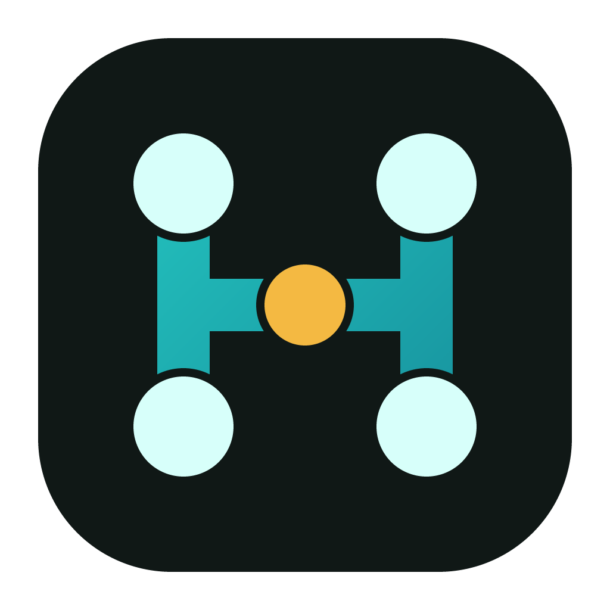

# Brand — OpenHarness

Nilo, the owl, is the OpenHarness identity. Edit the grid, then stamp it into the app and the installer.

 &nbsp; 

## Source of truth

`NILO_GRID` in `frontend/src/components/brand/niloGrid.ts` (16×13 cells). Everything else comes from it:

| File | Role |
|---|---|
| `nilo.svg` | Full mascot at 8px per cell, for use outside the app (README, social). |
| `mark.svg` | Face crop (the top 9 rows). Same shape as the title-bar `Mark`. |
| `icon.png` | 1024×1024 desktop/installer icon: the **H graph** mark (see below), drawn by `scripts/brand-icons.mjs`. |
| `app-icon.svg` | The same H-graph drawing as vector. Keep in step with `sample()` in the script. |
| `src-tauri/icons/*` | Tauri icon set (`icon.ico` with 16–256, `icon.icns`, PNGs). Gitignored. |

In the app, `Mark` (title bar) renders the grid directly as SVG, and `NiloSprite` animates it (`niloFrames.ts` builds each frame). Colours come from the `--nilo-*` tokens, so the body follows the theme.

## Desktop icon: the H graph

The owl is the in-app identity, but a pixel face turned to mush as a taskbar icon, so the desktop and installer icon is a separate vector mark: an H built as a graph (four nodes, three edges, one amber hub) on a graphite plate. Every size is drawn directly with analytic shapes, 4×4 supersampled; below 64px the node outlines and gradient are dropped and strokes thicken. The previous owl-on-plate icon is kept as `legacy/app-icon-nilo-legacy.png`.

## Update the logo

1. Edit `NILO_GRID` in `niloGrid.ts`.
2. From the repo root: `npm run brand:icons`. It is plain Node; no Rust or Tauri CLI is needed.
3. Rebuild the installer (`npm run tauri:build`) and reinstall. If Windows keeps showing the old icon, unpin and re-pin the taskbar item, or run `ie4uinit.exe -show` to refresh the icon cache.

Don't use `tauri icon` for this: it downsamples the 1024 PNG, which blurs a pixel sprite at 16–48px. The script draws every size directly at an integer cell size.

## Style lock

- Flat blocks on a pixel grid, the way Clawd is drawn. No outline, no shading, no highlights, no accessories (such as the old harness sash).
- Four colours, one role each: `B` body (`--nilo-body`, which is `--signal`), `W` eyes (`--nilo-eye`), `P` pupils (`--nilo-pupil`), `K` beak (`--nilo-beak`). Exported files use fixed stand-ins: `#3AB3AD`, `#F4EFE6`, `#161412`, `#D9A441`.
- Owl cues, in priority order: big oval eyes with 2×2 pupils that look around, an amber beak, inward ear tufts, and wing nubs that gesture and type.
- Nilo is animated, never a still picture in the app. `NiloSprite` acts out the agent's state (idle, thinking, working, waiting, success, error, sleeping), follows the pointer, reacts to clicks, and falls back to one still pose per state under `prefers-reduced-motion`. Live gallery: `/dev/nilo`.
- App-icon plate: `#191714` (≈ dark-theme `--sub-100`), with the same rounding as the old 64×64 `rx=12` plate.
- Integer scaling only: render at N px per cell with `shape-rendering: crispEdges`.

```
.B............B.
.BB..........BB.
.BBBBBBBBBBBBBB.
.BBBWWBBBBWWBBB.
.BBWWWWBBWWWWBB.
.BBWPPWBBWPPWBB.
.BBWPPWBBWPPWBB.
.BBBWWBKKBWWBBB.
.BBBBBBBBBBBBBB.
BBBBBBBBBBBBBBBB
.BBBBBBBBBBBBBB.
..BBBBBBBBBBBB..
....BB....BB....
```

## Legacy (kept on purpose, not in use: do not delete)

| File | What it is |
|---|---|
| `legacy/nilo-original-reference-legacy.png` | **Original reference.** 3D render of Nilo with the harness sash; this is where the character comes from. |
| `legacy/nilo-pixel-v2-legacy.png` | Pixel attempt v2: a pixelated copy of the render, far too detailed for a sprite. |
| `legacy/nilo-minimal-v3-legacy.png` | Pixel attempt v3: outlined, about 6 colours on a ~45-cell grid, and the raster downscale dropped pixels. |
| `legacy/app-icon-nodes-legacy.png` | Previous app icon (taskbar / Start menu until 2026-09-10): a node-graph glyph on a graphite plate. |
| `legacy/mark-nodes-legacy.svg` | Previous vector mark, with the same node-graph glyph. |
| `legacy/nilo-v1-flat-legacy.svg` | First Clawd-style sprite (13×11, one colour, ring eyes cut as holes). Replaced the same day because the ring eyes read as a staring robot. |
